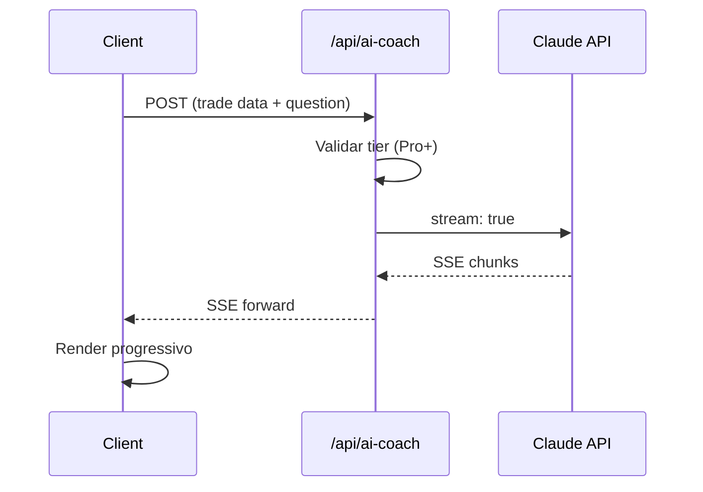

# AI Coach Architecture

## Decisão

Implementar AI Coach com streaming SSE usando Claude Haiku, tier-gated (Pro+).

## Arquitetura

## Detalhes

- **Modelo:** Claude Haiku (custo-efetivo)
- **Streaming:** SSE (Server-Sent Events) para resposta progressiva
- **Tier gate:** PaywallGate blur para Free users
- **Context:** Envia dados do trade atual + histórico recente
- **Design:** Card-container matching landing page mockup style

## Status

✅ 100% implementado e deployed.
⚠️ Pendente: usuário precisa de créditos na API Anthropic (~\$5) — key válida, saldo zero.

Ver: [[AI Coach]], [[MVP Revenue Design]]

#decisão #ai #claude
