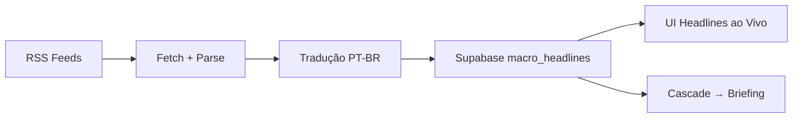

# Headlines Sources

## Fontes Ativas

| Fonte | Tipo | Conteúdo |
|-------|------|----------|
| **ForexLive** | RSS | Análise forex em tempo real |
| **Google News** | RSS | Headlines macro gerais |
| **Trading Economics** | Scrape | Dados econômicos, calendário |
| **Truth Social** | RSS | Posts políticos que movem mercado |

## Por que Financial Juice foi removido

Financial Juice era a fonte principal inicialmente, mas foi removida porque:

1. **API instável** — endpoint mudava frequentemente
2. **Rate limiting agressivo** — bloqueava após poucas requests
3. **Formato inconsistente** — parsing quebrava regularmente
4. **Alternativas melhores** — ForexLive RSS é mais confiável e gratuito

## Pipeline

Ver: [[Headlines ao Vivo]], [[Briefing Macroeconômico]]

#decisão #headlines #fontes
