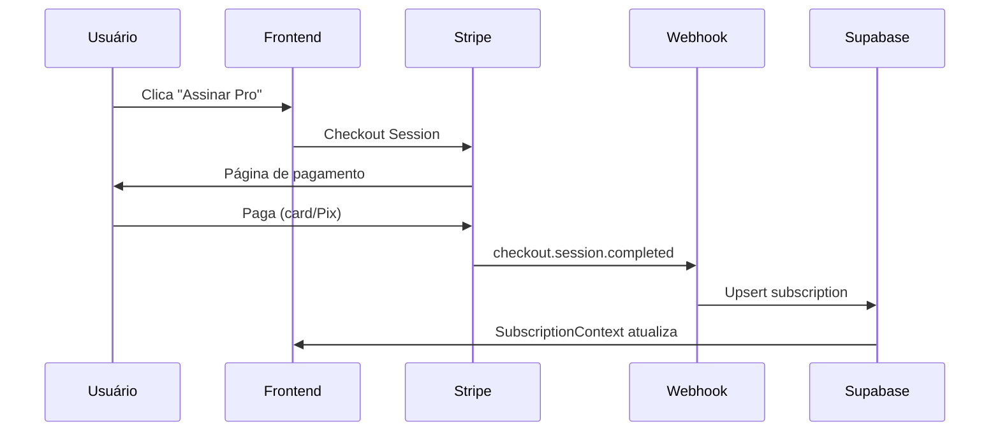

# Billing Stripe

## Visão Geral

Sistema completo de billing com Stripe suportando cartão de crédito e **Pix** (Brasil).

## Componentes

### Frontend
- `PricingCards` — 3 cards com toggle anual + confetti
- `PaywallGate` — Blur + upgrade prompt para features Pro/Ultra
- `SubscriptionContext` — Provider com tier atual do usuário
- Settings page — Link para Stripe Customer Portal

### Backend
- `/api/stripe/checkout` — Criar sessão de checkout
- `/api/stripe/portal` — Redirecionar para portal do cliente
- `/api/webhooks/stripe` — Webhook handler (checkout.session.completed, subscription events)

### Database
```sql
subscriptions (
  id, user_id, stripe_customer_id,
  stripe_subscription_id, status,
  tier (free/pro/ultra),
  current_period_start, current_period_end,
  created_at, updated_at
)
```

## Fluxo



Ver: [[MVP Revenue Design]]

#feature #billing #stripe
