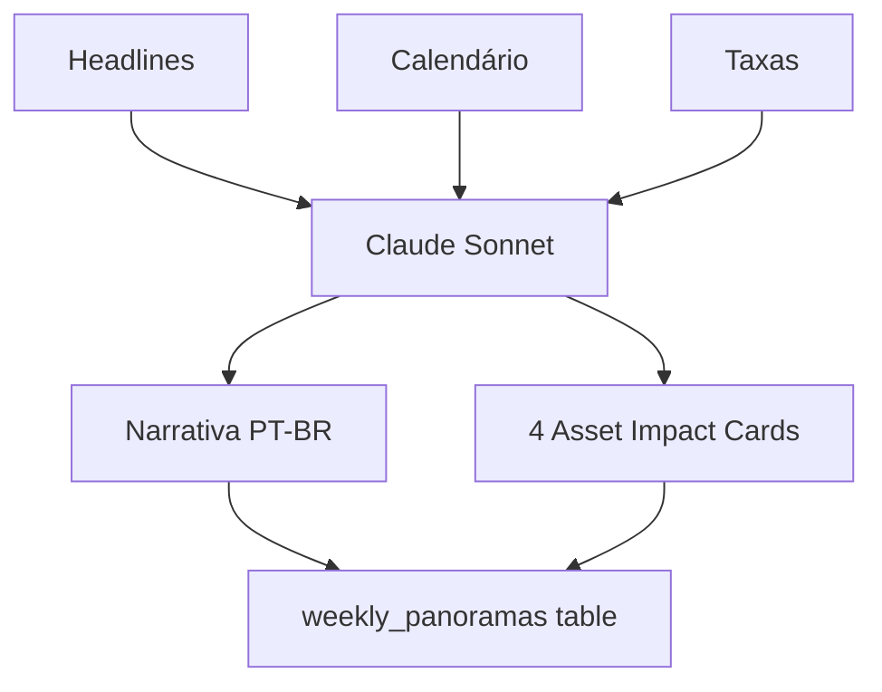

# Briefing Macroeconômico

## Visão Geral

Narrativa semanal gerada por **Claude Sonnet** analisando headlines, calendário e taxas. Inclui 4 cards de impacto por ativo. Tier **Pro+** apenas.

## Cascade Flow



## Schema

```sql
weekly_panoramas (
  id, week_start, week_end,
  narrative_pt, narrative_en,
  asset_impacts JSONB,
  model_used, prompt_tokens, completion_tokens,
  created_at
)
```

## Asset Impact Cards

Cada card mostra:
- Ativo (ex: EUR/USD)
- Direção esperada (bullish/bearish/neutral)
- Resumo do impacto
- Eventos-chave da semana

## Geração

- Modelo: Claude Sonnet (não Haiku — precisa de qualidade)
- Prompt otimizado para caber no timeout de 60s
- Geração semanal via cron

> [!info] Tamanho do prompt
> Prompt drasticamente reduzido para caber no timeout de 60s da Vercel.
> Ver commit: `eeba5e1 perf: drastically reduce narrative prompt size`

Ver: [[Headlines ao Vivo]], [[Macro Intelligence]], [[AI Coach Architecture]]

#feature #macro #briefing #ai
