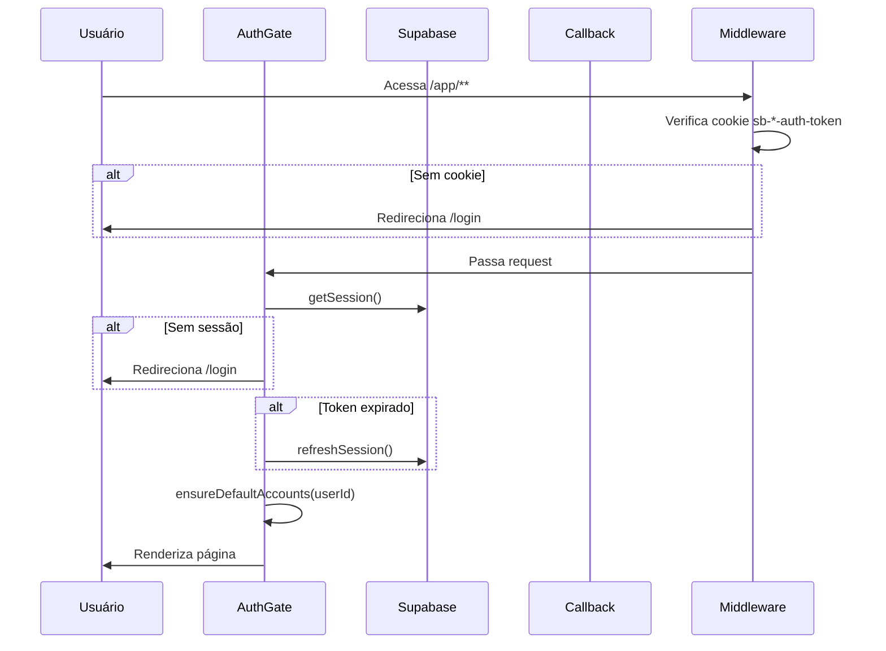

# Arquitetura

## Estrutura de Rotas

```
/                          → Landing page pública (spiral animation)
/login                     → Auth (signin/signup/magic link/Google OAuth)
/auth/callback             → OAuth + magic link handler
/onboarding                → Coleta display_name (novos usuários)
/app/**                    → Área autenticada (AuthGate)
  /app/journal             → Journal de trades
  /app/macro               → Inteligência macro
  /app/ai-coach            → AI Coach
  /app/settings            → Configurações + billing
/api/news                  → News proxy (ISR, 5min)
/api/webhooks/tradingview  → TradingView alert ingestion
/api/journal/import-mt5    → MT5 import (XLSX/HTML)
/api/macro/*               → Endpoints macro (calendar, rates, headlines, briefing)
```

## Auth Flow



> [!warning] Regras Críticas de Auth
> - **NUNCA** usar `supabase.auth.signOut()` — usar cleanup manual do localStorage
> - **NUNCA** usar `router.replace()` em auth flows — usar `window.location.href`
> - **NUNCA** usar `.single()` para queries que podem retornar null
> - **NUNCA** expor service_role key no client

Ver: [[Auth Flow]], [[Supabase Schema]]

## Client Architecture

### Supabase Clients
- **Browser (client components):** `@/lib/supabase/client` — singleton com anon key
- **API routes (server):** `@/lib/supabase/server` → `createSupabaseClientForUser(accessToken)`
- **Env validation:** throws `SupabaseConfigError` se env vars inválidas

### State Management
- `AuthEventContext` — listener único de `onAuthStateChange`, broadcast para consumers
- `ActiveAccountContext` — conta ativa em localStorage (`activeAccountId`)
- `SubscriptionContext` — tier do usuário (free/pro/ultra)
- `ThemeProvider` — tema em localStorage (`trading-dashboard-theme`)
- **Sem Redux, sem Zustand** — apenas Context API

### Custom Hooks (extraídos 2026-03-28)
- `useDashboardData()` — trades, accounts, prop data, equity curve, refresh logic
- `useNewsData()` — headlines fetching + memoização

### Account Bootstrap
Na primeira login, `ensureDefaultAccounts()` cria 4 contas:
- 2 prop accounts (The5ers 100k, FTMO 110k) com rows em `prop_accounts`
- 1 pessoal ("Pessoal"), 1 crypto ("Cripto")
- Idempotente — deduplica por nome
- Falha armazenada em sessionStorage → banner `BootstrapWarning`

## Layout Padrão (páginas autenticadas)

```
mx-auto max-w-6xl px-6 py-10
h1: text-2xl font-semibold tracking-tight
Subtitle: text-sm text-muted-foreground
Cards: shadcn <Card> com inline style para bg, rounded-[22px]
```

### Navegação Mobile
- **Desktop (≥768px):** Sidebar 260px com 5 links + settings/logout
- **Mobile (<768px):** Bottom tab bar (`AppMobileNav.tsx`) com 5 tabs
  - Dashboard, Journal, Macro, Analista, AI Coach
  - Framer Motion animated indicator, backdrop-blur glass
  - Header hamburger apenas para itens secundários (Prop, Settings, Logout)

### Segurança (pós-audit 2026-03-28)
- **CSP:** Content-Security-Policy com whitelist estrita em `next.config.mjs`
- **Middleware:** Cookie presence check em `/app/**` → redirect `/login`
- **Rate limiter:** DB-based (query `ai_coach_messages` últimos 60s, max 3)
- **requireEnv():** `lib/env.ts` substitui non-null assertions em API routes
- **Sentry PII:** scrubbing de tokens, emails, senhas via `beforeSend`

## Database

Ver: [[Supabase Schema]]

#projeto #arquitetura
