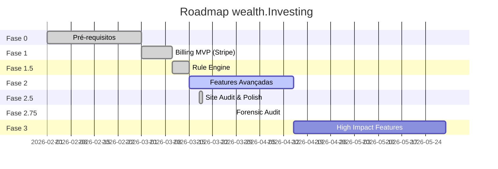

# Roadmap wealth.Investing

## Visão Geral

---

## Fase 0 — Pré-requisitos ✅

- [x] Formalizar parceria SML
- [x] Survey de validação (20-30 membros)
- [ ] ~~Fix MT5 HTML parser~~ — ADIADO
- [ ] ~~Testar parser MT4~~ — ADIADO
- [ ] Smoke test E2E — EM ANDAMENTO

## Fase 1 — Billing MVP ✅ COMPLETE

- [x] Stripe (card + Pix)
- [x] Webhooks para `subscriptions` table
- [x] RLS por subscription tier
- [x] SubscriptionContext + PaywallGate
- [x] PricingCards component
- [x] Pricing page + landing integration
- [x] Settings page (gerenciar assinatura)
- [x] Success page (pós-checkout)
- [x] Sentry integrado

> Ver: [[Billing Stripe]], [[MVP Revenue Design]]

## Fase 1.5 — Rule Engine ✅ COMPLETE

- [x] `drawdown_type` em prop_accounts
- [x] `prop_alerts` table
- [x] `calc_drawdown` RPC
- [x] DrawdownBar component
- [x] StaleBadge component
- [x] Alert toasts

> Ver: [[Alertas de Drawdown]]

## Fase 2 — Features Avançadas (PARCIAL)

- [x] AI Coach (streaming SSE, Claude, tier-gated) — **aguarda créditos API**
- [x] Calendar Redesign (dashboard + journal)
- [x] Landing page atualizada (pricing, feature visuals)
- [x] Macro Intelligence (calendar, rates, headlines, briefing)
- [ ] Dashboard consolidado "Visão Geral" (Pro+)
- [ ] Import melhorado (drag & drop, preview, discrepancy report)
- [ ] cTrader parser
- [ ] Onboarding expandido (4 steps)

> Ver: [[AI Coach]], [[Calendário Econômico]], [[Macro Intelligence]]

## Fase 2.5 — Site Audit & Polish ✅ COMPLETE

- [x] 14 bugs corrigidos
- [x] 8 novas páginas (4 features, manifesto, blog, changelog, academy)
- [x] 3 modals legais (cookies, privacidade, termos)
- [x] Navbar auth-aware
- [x] Análise competitiva completa

## Fase 2.75 — Forensic Audit ✅ COMPLETE (2026-03-28)

- [x] 105 findings identificados e 105 resolvidos (100%)
- [x] 23 CRITICAL, 29 HIGH, 33 MEDIUM, 16 LOW — todos fechados
- [x] Segurança: CSP, rate limiter DB, middleware guard, RLS hardening, error sanitization
- [x] Performance: AuthEventContext, dashboard hooks, pagination, visibility guards
- [x] UX: Mobile bottom tab bar, border radius 22px, WCAG AA, SEO metadata
- [x] Arquitetura: AuthEventProvider centralizado, useDashboardData/useNewsData hooks
- [x] 11 commits, 103 arquivos, 1497 inserções, 627 deleções

> Ver: [[Audit Forense 2026-03-28]]

## Fase 3 — High Impact Features (PENDENTE)

- [ ] Dashboard consolidado multi-conta
- [ ] cTrader parser
- [ ] Onboarding expandido (4 steps)
- [ ] Alertas por Telegram/Email
- [ ] Relatórios PDF exportáveis

> Ver: [[Phase 3 Features]]

---

> [!info] Pricing
> Free (R\$0) → Pro (R\$79.90/mês) → Ultra (R\$139.90/mês)
> Ver [[MVP Revenue Design]]

#projeto #roadmap
